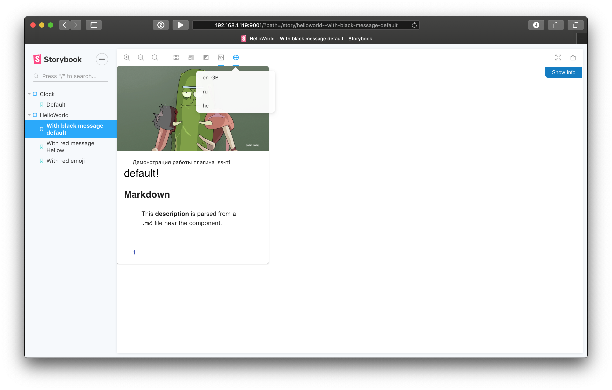

# Storybook I18n

> Warning! PR's will be reviewed and accepted, but this library is **deprecated** in favor of using [Storybook Addon Contexts](https://github.com/storybookjs/storybook/tree/master/addons/contexts), which can be used in the following way:

```javascript
  {
    icon: "globe",
    title: "Locale",
    components: [TargemProvider],
    params: [{name: "en", locale: "en", translations: {...}}],
  },
```

Storybook I18n Addon can be used to change the locale of the component inside the preview in [Storybook](https://storybook.js.org).

This is how I18n addon looks like:



This addon is made library-agnostic, it does not depend on any exact i18n tool you use in your application.

It can take any custom locale context provider and pass any custom props.
It can be used even to test your components in `ltr` and `rtl` fashion.

## Installation

```sh
npm i -D storybook-addon-i18n
```

## Simple Usage

> Currently React is supported only. PR's are always welcome!

### React

1. Create a file called addons.js in your Storybook config, if there is no any and append following line:

```js
import "storybook-addon-i18n/register.js";
```

2. Then in your story's config or in a global config for the project (`config.js`) add `i18n` key to parameters:

```js
import { addParameters } from "@storybook/react";

addParameters({
  i18n: {
    provider: LionessProvider,
    providerProps: {
      messages,
    },
    supportedLocales: ["en", "ru"],
    providerLocaleKey: "locale",
  },
});
```

3. Finally, Add decorator in your story's config or in a global config for the project (`config.js`)

- global config (`config.js`)

```js
import { addDecorator } from "@storybook/react";
import { withI18n } from "storybook-addon-i18n";

addDecorator(withI18n);
```

- story's config

```js
import { storiesOf } from "@storybook/react";
import { withI18n } from "storybook-addon-i18n";

storiesOf("Button", module).addDecorator(withI18n);
```

## API

Library accepts following parameters, which are passed as storybook parameters under `i18n` key:

- `provider` **required** - An internalization provider, which provides intl context to the app
- `providerProps` - All the props you need to pass to Provider, except locale
- `supportedLocales` **required** - An array of locale keys that your application support
- `providerLocaleKey` (`locale` by default) - prop name of the locale used by the library to pass active locale to provider
- `providerDirectionKey` (`direction` by default) - prop name of the direction key used by the libary to pass active direction (`rtl` or `ltr`) to provider
- `getDirection` - function, which accepts locale as an argument and should return `rtl` or `ltr`. By default it is returning `rtl` for `he` and `ar` locales

## Complex usage

### Material-UI

If you are using Material-UI, you need to test `jss-rtl` in your storybook too. The problem is that you need to wrap your storybook to `ThemeProvider`, which should recieve a `theme` with correct direction.

You can check an integration example in my [React boilerplate project](https://github.com/trucknet-io/trucknet-boilerplate-typescript-react).

To achive this task a common Provider should be created, which is used and in the Storybook and in the main application bundle. Here is an example:

```jsx
export class MuiLocaleProvider extends React.PureComponent<WithLocale> {
  public render() {
    const { locale, direction } = this.props;
    return (
      <LionessProvider locale={locale} messages={messages}>
        <MuiThemeProvider theme={createTheme(direction)}>
          <JssProvider {...jss}>
            <React.Fragment>
              <CssBaseline />
              {this.props.children}
            </React.Fragment>
          </JssProvider>
        </MuiThemeProvider>
      </LionessProvider>
    );
  }
}
```

Then this provider can be used in storybook config:

```js
addParameters({
  i18n: {
    provider: MuiLocaleProvider,
    providerProps: {
      messages,
    },
    supportedLocales,
  },
});
```

### react-i18next

Currently, [react-i18next doesn't support other props like `locale` except `i18n`](https://react.i18next.com/latest/i18nextprovider#i-18-nextprovider-props). If you want to use i18n storybook addon, you need to wrap `I18nProvider` with `useEffect` hook.

```jsx
export function I18nProviderWrapper({ children, i18n, locale }) {
  React.useEffect(() => {
    i18n.changeLanguage(locale);
  }, [i18n, locale]);
  return <I18nProvider i18n={i18n}>{children}</I18nProvider>;
}
```

This Provider wrapper should accept `providerLocaleKey` as props in storybook decorator parameter. If the props value corresponding to `providerLocaleKey` is changed, [we can programmatically change the language.](https://www.i18next.com/overview/api#changelanguage)

Then this provider can be used in storybook config:

```js
addParameters({
  i18n: {
    provider: I18nProviderWrapper,
    providerProps: {
      i18n,
    },
    supportedLocales,
  },
});
```
